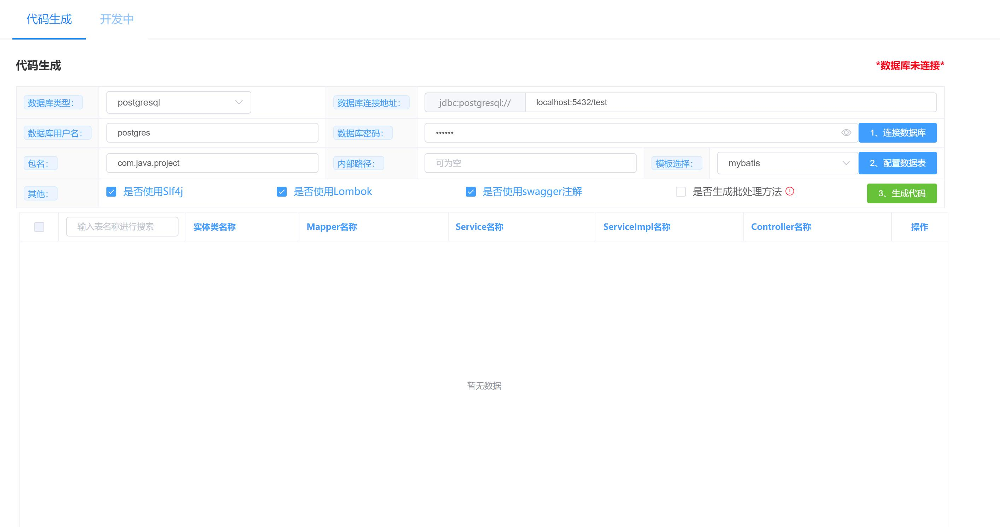

# generator

#### 介绍
postgresql\mysql 的逆向工程（生成的代码含：controller、service、serviceImpl、entity、mapper、mapper.xml）  

#### 软件架构
springboot + freemarker  

#### 安装教程
导入idea即可  

#### 使用说明
1、直接启动GeneratorApplication  
2、浏览器打开连接：http://ip:8888/index.html  
``
文档生成连接(生成HTML,测试中)：http://ip:8888/doc.html
`` 

#### 注：
1、因为运行环境是Windows，代码打包虽然是打包下载，但是在本地生成的代码并没有删除，可以根据需要调整；
本地目录在application.properties中配置：项目目录/generator_code  
2、表需要有主键，没有默认是id  

### 演示

#### 参考：
https://www.bilibili.com/video/BV1Vo4y1Z7af?share_source=copy_web  